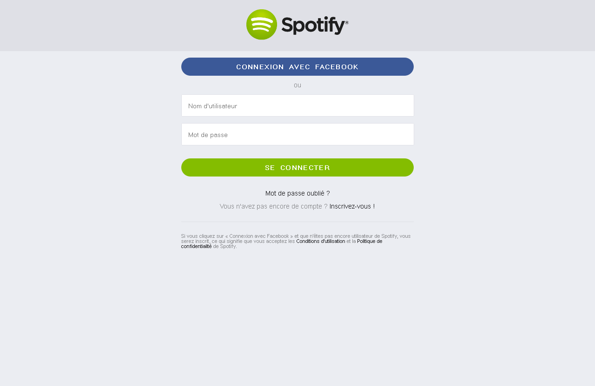

# Création de pages Web : CSS

> Lors de vos labos de *travaux dirigés*, vous allez découvrir le langage CSS et le mettre en pratique via de courts exercices de mise en situation.  
> Les labos de *travaux pratiques* vont vous confronter à des exercices pratiques et individuels reprenant la matière vue lors du TD précédent.

* * *

## Exercice «&nbsp;Spotify (accueil & login)&nbsp;»

Créer une feuille de style pour la page d'accueil (*index.html*) et une autre pour la page de login (*./html/login.html*)

NB : Pour les couleurs, il conviendra de les trouver (via colorzilla et zoom sur les rendus de cet énoncé) sauf les couleurs de survols, qui sont données.

---

### Consignes pour le style de la page d'accueil :

* reset de meyer (http://meyerweb.com/eric/tools/css/reset/)

* famille de polices sur la page : "Avenir","Helvetica Neue", "Helvetica", "Arial", "sans serif" et taille de police de base : 18 pixels

* l'en-tête utilise une couleur de fond noire à 60% d'opacité, ses marges intérieures du haut et du bas sont à 20 pixels et on utilise "width: 100%;	position: absolute;" pour le positionner en haut sur toute la largeur.

* le titre de l'entête possède un alinéa négatif de 101% afin de disparaitre

* les balises a dans le titre de l'en-tête doivent utiliser un affichage de boîte en bloc, d'une largeur de 100 pixels, avec des marges extérieures qui permettent le centrage horizontal, des marges intérieures de 10 pixels, une image de fond fournie (logo-spotify_white.png) qui ne doit pas se répéter avec une taille de fond de 100%.

* la classe intro précise une image de fond fournie (lifestyle-hero-lg.jpg), du contenu centré, des marges intérieures de 140 pixels en haut et 100 pixels en bas
	* des titres de niveau 2 d'une taille de police de 4em, avec un taux de graisse de 600, une marge intérieur en bas de 50 pixels, une largeur de 700 pixels et des marges extérieures qui permettent le centrage horizontal (! les titres de niveau2 de la classe descriptif doivent ensuite être inclus dans ce sélecteur)
	* des paragraphes d'une largeur de 800 pixels, avec des marges extérieures qui permettent le centrage horizontal, une taille de police de 1.2em et une marge extérieure du bas de 20 pixels

* la classe download précise une largeur de 350 pixels, des marges intérieures de 1em et extérieures de 1em en haut et en bas mais de 0em à gauche et à droite, un taux de graisse de 600, une taille de police de 0.9em, un espacement inter-lettres de 0.1em et inter-mots de 0.3em, il faut des petites majuscules, un bord arrondi à 10em et pas de traits pour le bord. Enfin, au survol, il faut changer de couleur (#729423)

* les balises a de la classe intro ont une taille de police de 0.7em

* la classe descriptif précise un alignement centré et une marge extérieure du bas de 50 pixels
	- des titres de niveau 2 avec une marge intérieure du bas de 50 pixels
	- des paragraphes d'une largeur de 800 pixels et des marges extérieures qui permettent le centrage horizontal

### Consignes pour le style de la page login :

* reset de meyer (http://meyerweb.com/eric/tools/css/reset/)

* la couleur de fond de la balise html est #ebedf2

* famille de polices sur la page : "Helvetica Neue", "Helvetica", "Arial", "sans serif" et taille de police de base : 18 pixels

* l'en-tête utilise des marges intérieures du haut et du bas de 20 pixels

* le titre de l'entête possède un alinéa négatif de 101% afin de disparaitre

* les balises a dans le titre de l'en-tête doivent utiliser un affichage de boîte en bloc, d'une largeur de 220 pixels et d'une hauteur de 70 pixels, avec des marges extérieures qui permettent le centrage horizontal, une image de fond fournie (logo-spotify.png) qui ne doit pas se répéter avec une taille de fond de 100%.

* la balise main possède une largeur de 500 pixels et des marges extérieures qui permettent le centrage horizontal

* les classes fbConnect et connexion précisent une largeur de 100%, des marges intérieures de 0.75em et extérieures de 1em en haut et en bas mais de 0em à gauche et à droite, un taux de graisse de 600, une taille de police de 0.75em, un espacement inter-lettres de 0.1em et inter-mots de 0.3em, il faut des petites majuscules, un bord arrondi à 10em et pas de traits pour le bord et un pointeur de souris en forme de "pointeur".

* au survol du fbConnect, il faut changer de couleur (#2d4373)

* la classe connexion seule(!) précise une couleur de fond différente et au survol, il faut changer de couleur (#729423)

* les balises strong dans les formulaires doivent utiliser un affichage de boîte en bloc, avec contenu centré, taille de police réduit à 3/4 par rapport à la taille héritée, marge extérieure du bas de 1em

* les labels ne s'affichent pas (! pas de rendu pour la boîte CSS)

* les champs input de type text et de type password ont une largeur de 94%, des marges intérieures de 1em, une marge extérieure du bas de 1em, un bord d'1 pixel d'épaisseur en trait plein et de couleur #dfe0e6, et une taille de police de 0.8em;

* les paragraphes dans la balise main ont un contenu centré, une taille de police de .8em et des marges extérieures du haut et du bas de 1em

* les balises a dans la balise main ne sont pas soulignement

* le pied de document possède une largeur de 500 pixels, des marges extérieures qui permettent le centrage horizontal, des marges extérieures du haut de 25 pixels et du bas de 10 pixels, une marge intérieure du haut de 25 pixels, une taille de police à 60% de la taille héritée, un bord du haut de 1 pixel d'épaisseur, en trait plein et de couleur #dfe0e6

* les balises a du pied de document ne sont pas soulignés

---

### Rendus :

Rendu avec CSS de la page d'accueil

---
Rendu avec CSS de la page de login

-----

Bon travail.
